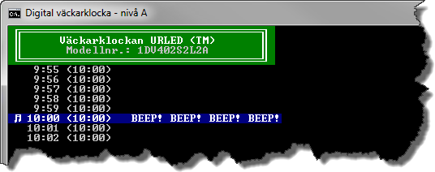

2.2 Digital väckarklocka (A-, B-, och C-nivå)
=============================================
[2-2-digital-vackarklocka.pdf](https://github.com/1dv402/kursmaterial/raw/master/Laborationsuppgifter/2-2-digital-vackarklocka.pdf)

"Digitala klockor visar tiden med siffror. Två sorters visning förekommer:

  * 24-timmars som visar 0:00 – 23:59
  * 12 timmars som visar 1:00 – 12:59

Du ska skriva ett program som simulerar en 24-timmars digital klockdisplay. För att simulera den digitala klockdisplayen ska du skriva och använda dig av klassen AlarmClock. Förutom att hålla ordning på aktuell tid ska även klassen kunna hantera en alarmtid. Du ska även testa att klassen fungerar som det är tänkt genom att skriva ett mindre test.
"

